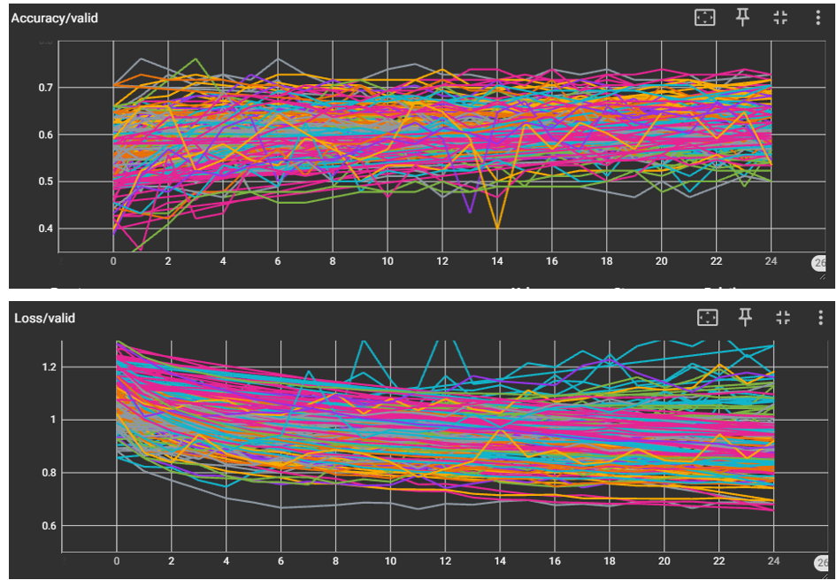
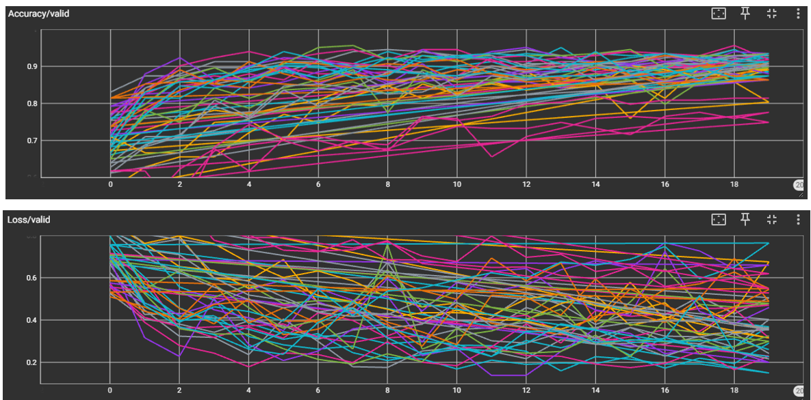
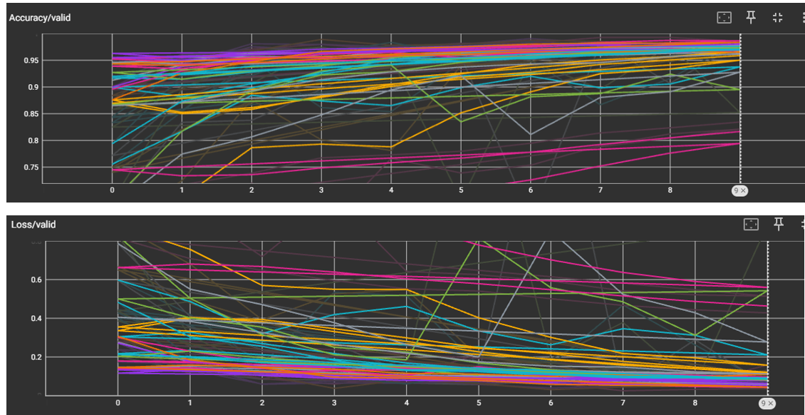

This project is about classifying the images of structural bridge bearings. The bridge bearings can be classified as one of "Good", "Fair", "Poor" and "Severe".
The dataset was taken from [University Libraries of Virginia Tech](https://data.lib.vt.edu/articles/dataset/Bearing_Condition_State_Classification_Dataset/16624642)

The original dataset is highly imbalanced. The distribution of the images are as follows:

| Condition State | # Images in training dataset | # Images in test dataset |
| :-------------- | :--------------------------: | -----------------------: |
| Good (1)        |         124                  |            13            |
| Fair (2)        |         215                  |            23            |
| Poor (3)        |         450                  |            50            |
| Severe (4)      |         90                   |            9             |

**Problem Statement:**

To predict the condition state of a bridge bearing given its image

**Solution Approach:**

* Leverage transfer learning by using [EfficientNet Models](https://docs.pytorch.org/vision/0.21/models/efficientnet.html)

    It is difficult to come up with a model rom scratch. It is easier to use pretrained model that build on similar dataset. In this project, the EffiicentNet models were chosen to classify the condition state of bridge bearings. The EfficientNet model cannot be used as it is for this problem, as the dataset that were used to build the EfficientNet models had 1000 classes while there are only four condition states viz. 'good', 'fair', 'poor', and 'severe'. So the classifier head was modified to suit the current problem of 4 classes. 
    Additionally, to take advantage of the trained EfficientNet model, the learned parameters of the features were freezed at their best values so that optimized weights do not change during the training process. The models used in this project were EfficientNet b0, EfficientNet b1, EfficientNet b2, EfficientNet b3 and EfficientNet b4. Furthermore, two optimizers (Adam with learing rate of 0.001 and SGD with learning rate of 0.1) were used for each these models resulting in 10 EfficientNet models.

* Preparation of data:

    The training set is split into training and validation datasets. These two datasets were used to train the models, while the test dataset was only used to report the accuracy. In the original dataset with highly imbalanced dataset, it was not possible to achieve decent accuracy in validation set as can be seen from the following tensorboard image. The top image shows the accuracy while the bottom one shows the crossentropy loss. One can see that there is no significant improvement with 25 epochs along the x-axis. The condition state of 'poor' itself makes up for close to 50% of the dataset, hence an accuracy ranging from 0.5 to 0.7 from all the 10 EfficientNet models is not sufficient.

     
    
    *Figure 1. Accuracy and loss curves for the original dataset*

    Thus, it is easy to see that imbalance in the dataset is severly hindering the training process. Data augmentation was the next step. In the data augmentation process, the transformation were used such that each class has similar number of samples. The transformations are resizing, horizontal flip, rotation, colorjitter, and randomperspective. It is to be noted these transformation do not affect the condition state of the bearing. For instance, when a poor bearing is flipped horizontally, it bearing is still poor. Thus these transformations are helpful in creating more samples of the same class. To further aid the fine turing process, the last layer of the feature of each EfficientNet model was unfreezed. The accuracy and the loss curves with this data augmentation were as shown below. It can be there is a significant improvement in the validation accuracy.

    

    *Figure 2. Accuracy and loss curves for the augmented dataset*

    The accuracy in the test set after this data augmentation was around 70%. Although this is not particularly impressive, there were encouraging signs through data augmentation. Another data augmentation was carried out to include VerticalFlip and Autocontrast. With this added data augmentation, the valition accuracy rose to above 95% with 10 epochs. The cross entropy loss also reduced to an impressive 0.1 to 0.3 range. For a single label four-class classification problem, the cross entropy loss with random guess is about 1.3. The validation accuracy and the loss can be observed in the following image.

    

    *Figure 3. Accuracy and loss curves for the augmented dataset with two additional transformations*

    **The accuracy on the test dataset that was not used in any training process was about 75%**

* Key Takeaway:
    The machine building process is an iterative process. one need not figure out everything to get started. I just started with the data that I was available. As the bottlenecks surface, the solutions can be implemented by seeking help from subject matter experts, online searching or thinking about ways to implement the next iteration. I found the tensorboard extremely helpful in keeping track of the experiments. This is the key feature of MLops.

* App

   An interactive app based on this ensemble model is deployed on HuggingFace and can be accesed [here](https://huggingface.co/spaces/Hemanth-TN/Bearing-Classification)

   Note: Kindly restart the space if the app is found sleeping.
